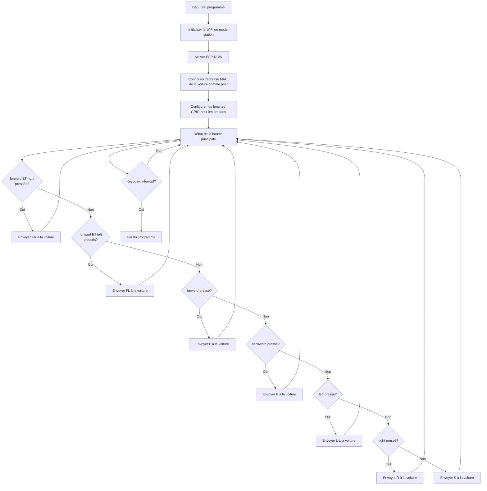

```mermaid
flowchart TD
    A[Début du programme] --> B[Initialiser le WiFi en mode station]
    B --> C[Activer ESP-NOW]
    C --> D[Configurer l'adresse MAC de la voiture comme peer]
    D --> E[Configurer les broches GPIO pour les boutons]
    E --> F[Début de la boucle principale]
    
    F --> G1{forward ET right\npressés?}
    G1 -- Oui --> I1[Envoyer FR à la voiture]
    I1 --> F
    
    G1 -- Non --> G2{forward ET left\npressés?}
    G2 -- Oui --> I2[Envoyer FL à la voiture]
    I2 --> F
    
    G2 -- Non --> G3{forward pressé?}
    G3 -- Oui --> I3[Envoyer F à la voiture]
    I3 --> F
    
    G3 -- Non --> G4{backward pressé?}
    G4 -- Oui --> I4[Envoyer B à la voiture]
    I4 --> F
    
    G4 -- Non --> G5{left pressé?}
    G5 -- Oui --> I5[Envoyer L à la voiture]
    I5 --> F
    
    G5 -- Non --> G6{right pressé?}
    G6 -- Oui --> I6[Envoyer R à la voiture]
    I6 --> F
    
    G6 -- Non --> H7[Envoyer S à la voiture]
    H7 --> F
    
    F --> X{KeyboardInterrupt?}
    X -- Oui --> Z[Fin du programme]
    X -- Non --> F
```