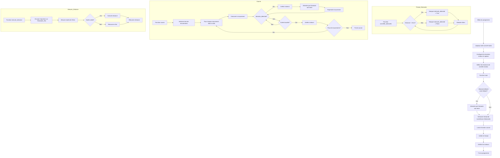

```mermaid
flowchart TD
    A[Début du programme] --> B[Initialiser WiFi et ESP-NOW]
    B --> C[Configurer les broches moteur et capteur]
    C --> D[Définir les fonctions de contrôle moteur]
    D --> E[Fonction main]
    
    E --> F{Obstacle détecté\navant départ?}
    F -- Oui --> G[Attendre que l'obstacle\nsoit retiré]
    G --> H
    F -- Non --> H[Démarrer thread de\nsurveillance d'obstacles]
    
    H --> I[Lancer fonction course]
    
    subgraph Thread_Obstacles
        T1[Fonction surveiller_obstacles] --> T2{Distance < 15cm?}
        T2 -- Oui --> T3[Marquer obstacle_detected = True]
        T2 -- Non --> T4[Marquer obstacle_detected = False]
        T3 --> T5[Attendre 50ms]
        T4 --> T5
        T5 --> T2
    end
    
    subgraph Course
        I1[Fonction course] --> I2[Initialiser liste de mouvements]
        I2 --> I3[Pour chaque mouvement dans la liste]
        I3 --> I4[Exécuter le mouvement]
        I4 --> I5{obstacle_detected?}
        I5 -- Oui --> I6[Arrêter moteurs]
        I6 --> I7[Attendre que l'obstacle\nsoit retiré]
        I7 --> I8[Reprendre mouvement]
        I8 --> I5
        I5 -- Non --> I9{Durée écoulée?}
        I9 -- Non --> I5
        I9 -- Oui --> I10[Arrêter moteurs]
        I10 --> I11{Plus de mouvements?}
        I11 -- Oui --> I3
        I11 -- Non --> I12[Fin de course]
    end
    
    I --> J[Arrêter le thread]
    J --> K[Arrêter les moteurs]
    K --> L[Fin du programme]
    
    %% Fonction mesurer_distance
    subgraph Mesurer_Distance
        M1[Fonction mesurer_distance] --> M2[Envoyer impulsion sur TRIGGER_PIN]
        M2 --> M3[Mesurer durée de l'écho]
        M3 --> M4{Durée valide?}
        M4 -- Oui --> M5[Calculer distance]
        M4 -- Non --> M6[Retourner infini]
        M5 --> M7[Retourner distance]
        M6 --> M7
    end
```